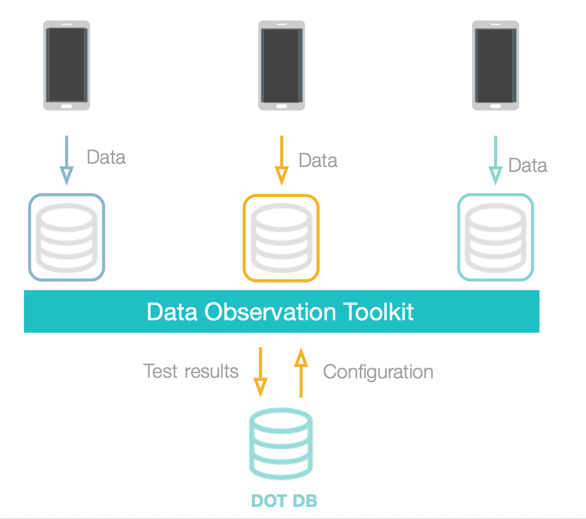
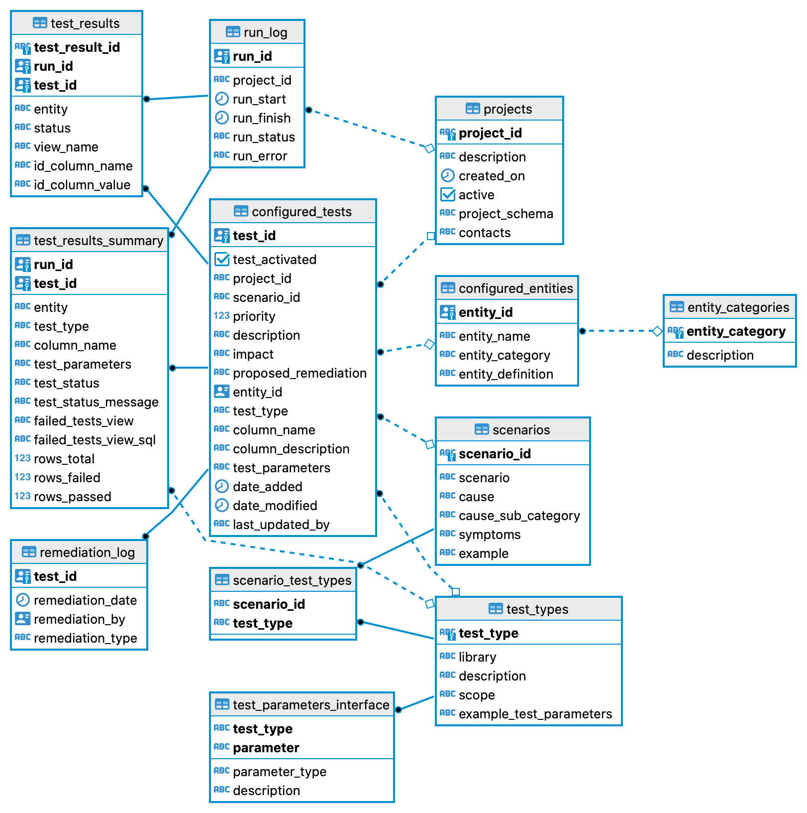

# Introduction 

The Data Observation Toolkit (DOT) can
be configured to monitor data integrity issues such as blank values, duplicates and referential consistency 
as well as more advanced tests such as outlier detection and domain-specific issues identified using custom SQL. 
The codebase includes a DOT database with support for test taxonomy, domain area, and priority. Multiple projects can 
be defined and results can be tracked over time.

 

# Getting started
## First, what happens when I run DOT?

When you run DOT, it does the following:

1. Using the data in DB tables defined in `dot.configured_entities`, sets up database views containing data DOT will test
2. Using the data in `dot.configured_tests`, generates `yml`, `sql` and `json` test files needed by dbt and great expectations
3. DOT runs tests using Great expectations and DBT 
3. Results are saved to `dot.run_results` and `dot.run_results_summary`, but also to test views which have the tested 
   data for any failed tests. These views start with `tr_`
4. Some reports are created into `dot/generated_reports` (we will be using these in the next release)
5. The run log is saved to `dot.run_log`

## Running DOT using Docker 

The fastest way to get started using DOT is to use the Docker environment provided with it. This will build a DOT Database,
a container for running DOT as well as another container for running Superset dashboards.

### Prerequisites

First make sure you have checked the
[Docker prerequisites](https://github.com/datakind/medic_data_integrity/tree/main/docker#pre-requisites). We recommend 
 using at least 4GB memory which can be set in the docker preferences, but this can vary depending on the volume of data 
 being tested. If running on a Mac M1 chip, you might need to set export DOCKER_DEFAULT_PLATFORM=linux/amd64 and have [Rosetta](https://support.apple.com/en-us/HT211861) installed
 
### Building the DOT Docker environment
  
1. Save a postgres password to your local environment `export POSTGRES_PASSWORD=<some password you decide>`
2. Build the docker containers: `docker compose build`
3. Start the environment: `docker compose up -d`

Your environment is now running! 

## Setting up a project and tests to scan with DOT
### If using the static Medic 'Muso' database dump 

For a really quick start we have configured entities and tests to work with a specific dump from the `datakind` schema in 
the `musoapp` production database. This will allow you to get up-and-running with DOT before deploying to production.
You will need to:

1. Dowload [database dump](https://drive.google.com/file/d/1GNC4nql3OLbm-GKmaonYsobxZkXaVES_/view?usp=sharing) and save into `./docker`
2. Restore the your db from the file downloaded in step 1. to the `dot-db` container 
    - `docker exec -ti dot-db sh -c "pg_restore --dbname=dot_db -U postgres /db_dumps/IoP.tar"`

The above database dump was made in Q4 2021 and is only for objects visble in the Muso `datakind` schema. For reference, 
you can see how the DOT db has been configured in [3-upload_sample_data.sql](./db/dot/3-upload_sample_data.sql)

### Deploying DOT to production

If you are ready to set up DOT to scan production data, you will need to:

1. Choose where to host the DOT database
   - It can be a separate database to the data being scanned or even in the same 
   database as the data (it will be separated from the data in dedicated schemas)
2. In that database, create DOT DB objects: Run [./db/dot/1-schema.sql](./db/dot/1-schema.sql)
3. Populate DOT static data: Run [./db/dot/2-upload_static_data.sql](./db/dot/2-upload_static_data.sql)
4. Decide on a project name for your scan, eg 'Muso'
5. Edit the [Main config file](#main-config-file) and add a section for your new project
5. Also set the section `dot_db` in [Main config file](#main-config-file) to point at the DOT database 
6. Create a project for your data in the DOT DB by inserting a row into table `dot.projects`:
    - `INSERT INTO dot.projects SELECT 'Muso', 'Muso project', '2021-12-07 00:00:00+00', 'true', 'public';`
4. Define some entities (views onto the data being tested ), see section [How to add new entities](#how-to-add-new-entities) below
5. Configure tests to run, see section [How to configure tests](#how-to-configure-tests)
6. Decide which host to run DOT on
   - If **not** using the provided Docker build, you will need to deploy the version of Python 
   and packages as defined in this [Dockerfile](./Dockerfile)

**Note:** DOT can also be configured to scan multiple databases using Airflow to synchronize data into the DOT database. See [Deploying in Airflow](#deploying-in-airflow)
below. 

## Running DOT

**Note:** If using Docker, you will first need to exec into the DOT container with: 

`docker exec -it dot /bin/bash`

Then to run DOT:

`cd dot`
`python3 ./run_everything.py --project_id '<project name>'`

For example, if you used the provided Medic Muso database dump, you would run with ...

`python3 ./run_everything.py --project_id 'Muso'`

Now time for some real fun!

# Viewing test results

Your test results will be in the `dot-db` container. You can view the results by opening a shell in the dot-db container:

`docker exec -it dot-db /bin/bash`

Then running the psql client locally in that container:

`psql -U postgres -d dot_db`


Or if you prefer a database client (like [DBeaver](https://dbeaver.io)), you can use there settings:
```
host=localhost
port=5433 
database=dot_db
user=postgres
password=<the password from 3.>
```

Note: The host and port are set in the [docker-compose.yml](./docker/docker-compose.yml)

To see some raw results you can run `SELECT * from dot.test_results LIMIT 100;`

## Some useful database queries 

The following queries might be useful for visualizing the DOT DB schema and data:

### Statistics on failed tests

```
SELECT
   tr.run_id,
   ct.test_type,
   COUNT(*)
FROM
   dot.test_results tr,
   dot.configured_tests ct 
WHERE
   tr.test_id = ct.test_id
GROUP BY
   tr.run_id,
   ct.test_type
ORDER BY
   ct.test_type
```

Same, but adding in test description and entity names in grouping ...

```
SELECT
   tr.run_id,
   tr.view_name, 
   ct.test_type,
   ct.description,
   ce.entity_name,
   COUNT(*)
FROM
   dot.test_results tr,
   dot.configured_tests ct,
   dot.configured_entities ce 
WHERE
   tr.test_id = ct.test_id AND
   ce.entity_id = ct.entity_id
GROUP BY
   tr.run_id,
   tr.view_name, 
   ct.test_type,
   ct.description,
   ce.entity_name
ORDER BY
   tr.run_id,
   tr.view_name, 
   ct.test_type,
   ct.description,
   ce.entity_name

```

### Linking DOT Data scenarios with configured tests

```
SELECT 
   s.*,
   ct.*
FROM
   dot.scenarios s,
   dot.configured_tests ct 
WHERE 
   s.scenario_id=ct.scenario_id
```

### Linking configured tests to test results

```
SELECT 
   s.*,
   ct.*,
   ce.entity_name,
   tr.*
FROM
   dot.scenarios s,
   dot.configured_tests ct,
   dot.test_results_summary tr,
   dot.configured_entities ce
WHERE 
   s.scenario_id=ct.scenario_id AND
   tr.test_id=ct.test_id AND
   ce.entity_id = ct.entity_id
LIMIT 10
```

### Deactivating all tests except one dbt and one great expectation

`update dot.configured_tests set test_activated=false where test_id not in ('7db8742b-c20b-3060-93e2-614e35da2d4b','0f26d515-a70f-3758-8266-8da326d90eb6')`

### Seeing the raw data for failed tests

dot.test_results column `view_name` provides the name of the DB view which holds the data for failed tests. Additionally,
columns `id_column_name` and `id_column_value` provide the columns to match in the DB entity view, ie the data that was
tested. Finally, you can query to get the underlying data for each test using function `get_dot_data_record`


```
SELECT 
   tr.test_id,
   tr.status,
   dot.get_test_result_data_record(ce.entity_name, tr.id_column_name, 
   tr.id_column_value,'public_tests')
FROM
   dot.scenarios s,
   dot.configured_tests ct,
   dot.configured_entities ce,
   dot.test_results tr
WHERE 
   s.scenario_id=ct.scenario_id AND
   tr.test_id=ct.test_id and 
   ce.entity_id=ct.entity_id
LIMIT 10
```

Where the function parameters are:

- Test entity name
- Test result ID column name (in entity view)
- Test Result ID column value
- Test results schema name

This returns a json record for the data that was tested. **Note:** If using the airflow environment, change `public_tests`
to the schema where the data is, for example `data_musoapp`.

# Configuring DOT
## How to add new entities
The DOT will run tests against user-defined views onto the underlying data. These views are called "entities" and defined in table `dot.configured_entities`:


| Column | Description |
| :----------- | :----------- |
| entity_id | UUID of the entity |
| entity_name | Name of the entity e.g. ancview_danger_sign |
| entity_category | Category of the entity e.g. anc => needs to be in `dot.entity_categories` |
| entity_definition | String for the SQL query that defines the entity |

For example, this would be an insert command to create `ancview_danger_sign`:

```postgres-sql
INSERT INTO dot.configured_entities VALUES('b05f1f9c-2176-46b0-8e8f-d6690f696b9b', 
'ancview_danger_sign', 'anc', '{{ config(materialized=''view'') }}


select *
from {{ schema }}.ancview_danger_sign');

```

Note: UUID in the above statement will be overwritten with an automatically generated value.

All entities use Jinja macro statements - the parts between `{ ... }` - which the DOT uses to create the entity 
materialized views in the correct database location. Use the above format for any new entities you create.

The SQL for the view definition can be more complex than the example above, combining data from multiple underlying 
tables or views. For example: 

```postgres-sql
{{ config(materialized=''view'') }}


select ap.*,
        ap.lmp as lmp_date,
        DATE_PART(''day'', reported - lmp) as days_since_lmp
from {{ schema }}.ancview_pregnancy ap

```

When you add a new entity to the configuration, take a look to the existing `dot.entity_categories` to associate your new entity
to one of them. If you need to add a new category, the table `dot.entity_categories` has the following columns:
| Column | Description |
| :----------- | :----------- |
| entity_category | Category of the entity e.g. anc |
| description | A description of the category |

An example of an insert statement would be:
`INSERT INTO dot.entity_categories VALUES('anc', 'antenatal care');`

## How to configure tests  
Tests are defined in the table `dot.configured_tests`. Each test has an associated `test_type`, a list of which can be 
found in table `dot.test_types` (see section "DOT Database Schema" below for more details on the full schema).

To use one of these test types for a new test, insert a new row in `dot.configured_tests`.

Here are the columns included in a test:
| Column | Description |
| :----------- | :----------- |
test_activated | Whether the test is activated or not
project_id | ID of the project, for example "`Muso`"
test_id | UUID of the test
scenario_id | ID of the scenario
priority | Priority level
description | Description of the test
impact | Why the test is important
proposed_remediation | How the issue in this test might be solved
entity | The entity against which the test runs (check `entities` below)
test_type | Test type
column_name | The column in the table against which the test runs
column_description | Description of the above column
test_parameters | Any parameters the test takes in
date_added | Date when the test was added
date_modified | Date when the test was last modified
last_updated_by | Person who last updated the test

The UUID in the above example will get overwritten with an automatically generated value. Also, your test must be unique 
for the project. If you get a key violation it's probably because that test already exists.

#### Test validation

Any insert of update of configured tests will call database function `dot.test_validation`, as defined in 
[./db/dot/1-schema.sql](./db/dot/1-schema.sql). This function performs some basic validation to ensure test parameters
are in an expected format. It is not infallable, if there are any issues with test parameters and tests do not execute,
you can confirm this by looking at columns `test_status` and `test_status_message` in `dot.test_results_summary`.

#### Example `INSERT` statements for adding a new test for each test type:

**Note:** In all of the following examples, the UUID in the insert statement will be replaced with an automatically 
generated one.

1. `relationship`
    <br><br>
    ```
    'INSERT INTO dot.configured_tests VALUES(TRUE, 'Muso', '0cdc9702-91e0-3499-b6f0-4dec12ad0f08', 'ASSESS-1', 3, '', '', 
    '', 'dot_model__ancview_pregnancy', 'relationships', 'uuid', '', 
    'name: danger_signs_with_no_pregnancy| to: ref(''dot_model__ancview_danger_sign'')| field: pregnancy_uuid', 
    '2021-12-23 19:00:00.000 -0500', '2021-12-23 19:00:00.000 -0500', 'your-name');
    ```
2. `unique`
    <br><br>
    ```
    INSERT INTO dot.configured_tests VALUES(TRUE, 'Muso', '52d7352e-56ee-3084-9c67-e5ab24afc3a3', 'DUPLICATE-1', 3, '', 
    '', '', '6ba8075f-6f35-4ff1-be3a-4c75d0884bf4', 'unique', 'uuid', 'alternative index?', '', 
    '2021-12-23 19:00:00.000 -0500', '2021-12-23 19:00:00.000 -0500', 'your-name');
    ```
3. `not_negative_string_column`
    <br><br>
    ```
    INSERT INTO dot.configured_tests VALUES(TRUE, 'Muso', '8aca2bee-9e95-3f8a-90e9-153714e05367', 'INCONSISTENT-1', 3, 
    '', '', '', '95bd0f60-ab59-48fc-a62e-f256f5f3e6de', 'not_negative_string_column', 'patient_age_in_years', '', 'name: patient_age_in_years', '2021-12-23 19:00:00.000 -0500', '2021-12-23 19:00:00.000 -0500', 'your-name');
    ```
4. `not_null`
    <br><br>
    ```
    INSERT INTO dot.configured_tests VALUES(TRUE, 'Muso', '549c0575-e64c-3605-85a9-70356a23c4d2', 'MISSING-1', 3, '', 
    '', '', '638ed10b-3a2f-4f18-9ca1-ebf23563fdc0', 'not_null', 'patient_id', '', '', '2021-12-23 19:00:00.000 -0500', '2021-12-23 19:00:00.000 -0500', 'your-name');
    ```
5. `accepted_values`
    <br><br>
    ```
    INSERT INTO dot.configured_tests VALUES(TRUE, 'Muso', '935e6b61-b664-3eab-9d67-97c2c9c2bec0', 'INCONSISTENT-1', 3, 
    '', '', '', '95bd0f60-ab59-48fc-a62e-f256f5f3e6de', 'accepted_values', 'fp_method_being_used', '', 'values: [''oral mini-pill (progestogen)'', ''male condom'', ''female sterilization'', ''iud'', ''oral combination pill'', ''implants'', ''injectible'']', '2021-12-23 19:00:00.000 -0500', '2021-12-23 19:00:00.000 -0500', 'your-name');
    ```
6. `possible_duplicate_forms`
    <br><br>
    ```
    INSERT INTO dot.configured_tests VALUES(TRUE, 'Muso', '7f78de0e-8268-3da6-8845-9a445457cc9a', 'DUPLICATE-1', 3, '', 
    '', '', '66f5d13a-8f74-4f97-836b-334d97932781', 'possible_duplicate_forms', '', '', 'table_specific_reported_date: delivery_date| table_specific_patient_uuid: patient_id| table_specific_uuid: uuid', '2021-12-23 19:00:00.000 -0500', '2021-12-23 19:00:00.000 -0500', 'your-name');
    ```
7. `associated_columns_not_null`
    <br><br>
    ```
    INSERT INTO dot.configured_tests VALUES(TRUE, 'Muso', 'd74fc600-31c3-307d-9501-5b7f6b09aff5', 'MISSING-1', 3, '', 
    '', '', 'dot_model__iccmview_assessment', 'associated_columns_not_null', 'diarrhea_dx', 'diarrhea diagnosis', 
    'name: diarrhea_dx_has_duration | col_value: True | associated_columns: [''max_symptom_duration'']', 
    '2021-12-23 19:00:00.000 -0500', '2021-12-23 19:00:00.000 -0500', 'your-name');
    ```
8. `expect_similar_means_across_reporters`
    <br><br>
    ```
    INSERT INTO dot.configured_tests VALUES(TRUE, 'Muso', '0cdc9702-91e0-3499-b6f0-4dec12ad0f08', 'BIAS-1', 3, 
    'Test for miscalibrated thermometer', '', '', 'baf349c9-c919-40ff-a611-61ddc59c2d52', 'expect_similar_means_across_reporters', 
    'child_temperature_pre_chw', '', '{"key": "reported_by","quantity": "child_temperature_pre_chw",
    "form_name": "dot_model__iccmview_assessment","id_column": "reported_by"}', '2022-01-19 20:00:00.000 -0500', 
    '2022-01-19 20:00:00.000 -0500', 'your-name');
    ```
9. `expression_is_true`
    <br><br>
    ```
    INSERT INTO dot.configured_tests VALUES(TRUE, 'Muso', '3081f033-e8f4-4f3b-aea8-36f8c5df05dc', 'INCONSISTENT-1', 3, 
    'Wrong treatment/dosage arising from wrong age of children (WT-1)', '', '', 'baf349c9-c919-40ff-a611-61ddc59c2d52', 
    'expression_is_true', '', '', 
    'name: "t_under_24_months_wrong_dosage"| expression: "malaria_act_dosage is not null"| condition: "(patient_age_in_months<24) and (malaria_give_act is not null)"', 
    '2022-02-14 19:00:00.000 -0500', '2022-02-14 19:00:00.000 -0500', 'your-name');
    ```
10. `custom_sql`
<br><br>
Custom SQL queries require special case because they must have `primary_table` and `primary_table_id_field` specified within the SQL query as shown below:
    ```
    INSERT INTO dot.configured_tests VALUES (TRUE, 'Muso', '3081f033-e8f4-4f3b-aea8-36f8c5df05dc','INCONSISTENT-1',5,
    'LMP Date at Beginning of Month','10','Use days/weeks since LMP instead of months as this may be much closer to the actual LMP instead of months since LMP','638ed10b-3a2f-4f18-9ca1-ebf23563fdc0','custom_sql','','','select
        ap.uuid,
        ap.days_since_lmp,
        cnt.proportion as tot_proportion,
        ''dot_model__ancview_pregnancy'' as `primary_table`,
        ''uuid'' as `primary_table_id_field`
      from
      (
              select round(days_since_lmp::float) days_since_lmp,
                      count(*)*100.0/sum(count(*)) over() proportion
              from {{ ref(''dot_model__ancview_pregnancy'') }} ap
              where lmp_date is not null
              group by round(days_since_lmp::float)
      ) cnt
      join
      {{ ref(''dot_model__ancview_pregnancy'') }} ap
      on cnt.days_since_lmp = ap.days_since_lmp
      where cnt.proportion>1','2022-02-15 20:00:00.000 -0500','2022-02-15 20:00:00.000 -0500','your_name');
    ```


### Activating/Deactivating existing tests

Note that it's possible to deactivate tests, which can sometimes be useful for testing. To do this simply 
set `test_activated=False` in table `dot.configured_tests`. For example:
 
 
` update dot.configured_tests set test_activated=false where test_id not in ('7db8742b-c20b-3060-93e2-614e35da2d4b','0f26d515-a70f-3758-8266-8da326d90eb6'); `

# Advanced topics

## The DOT DB Schema
The DOT Database schema is defined as follows:

 

Tables are defined as follows:

| Table | Description |
| :----------- | :----------- |
| projects | Defines the projects the DOT can be run for. Typically a project is associated with a single source database where the data resides |
| configured_entities | Holds entities, which are the views onto underlying data the DOT will test |
| entity_categories | Category of each entity, for example "Pre-natal care". Useful for segmenting DOT results by category.
| configured_tests | the table which defines what tests to run for each project
| scenarios | The DOT Taxonomy scenario for each test |
| test_types | The available test types for each test, eg null, unique, custom_sql |
| scenario_test_types | The test types that apply for any given scenario |
| test_parameters_interface | JSON object defining Interface parameters required for each test type. Note: Not currently used but will be in future |
| run_log | Log of DOT runs, with stop/start times and failure message |
| test_results | Main test results table, indicating test fails |
| test_results_summary | Aggregated test results for each run |
| remediation_log | Record of remediation actions. (Note: Not yet implemented) |

The test_results table includes fields to link back to the data tested. This can be a fixed table or view, but also a 
custom SQL query. Given this, there is a useful Postgres function which will retreive a JSON record for the data tested,
see 'Seeing the raw data for failed tests' above.
 

## More complex configuration options

All the configuration files must be located under the [config](dot/config) folder of the DOT.

### Main config file

The main config file must be called `dot_config.yml` and located at the top [config](dot/config) folder. Note that 
this file will be ignored for version control. You may use the [example dot_config yaml](dot/config/example/dot_config.yml)
as a template.

Besides the DOT DB connection in the paragraph above, see below for additional config options.

#### Connection parameters for each of the projects to run

For each of the projects you would like to run, add a key to the DOT config yaml with the following structure:
```
<project_name>_db:
  type: connection type e.g. postgres
  host: host
  user: username
  pass: password
  port: port number e.g 5432
  dbname: database name
  schema: schema name, e.g. public
  threads: nubmer of threads for DBT, e.g. 4
```

#### Output schema suffix

The DOT generates 2 kind of database objects:
- Entities of the models that are being tested, e.g. assessments, follow ups, patients
- Results of the failing tests

If nothing is done, these objects would be created in the same schema as the original data for the project 
(thus polluting the DB). If the key `output_schema_suffix` is added, its value will be added as a suffix; i.e. if the 
project data is stored in a certain schema, the output objects will go to `<project_schema>_<schema_suffix>` 
(e.g. to `public_tests` if the project schema is `public` and the suffix is set to `tests` in the lines above).

Note that this mechanism uses a DBT feature, and that the same applies to the GE tests.

#### Save passed tests

The key `save_passed_tests` accepts boolean values. If set to true, tha results of the passing tests will be also stored
to the DOT DB. If not, only the results of failing tests will be stored.

### Other config file locations
Optional configuration for DBT and Great Expectations can be added, per project, in a structure as follows.

```bash
|____config
| |____<project_name>
| | |____dbt
| | | |____profiles.yml
| | | |____dbt_project.yml
| | |____ge
| | | |____great_expectations.yml
| | | |____config_variables.yml
| | | |____batch_config.json
```
In general these customizations will not be needed, but only in some scenarios with particular requirements; these 
require a deeper knowledge of the DOT and of either DBT and/or Great Expectations.

There are examples for all the files above under [this folder](dot/config/example/project_name). For each of the 
files you want to customize, you may copy and adapt the examples provided following the directory structure above.

More details in the [config README](dot/config/README.md).

## How to visualize the results using Superset

At time of writing Superset setup isn't fully automated, so once your Docker containers are running the first time, 
run these commands:

```
docker exec -it superset superset fab create-admin  --username admin  --firstname Superset  --lastname Admin   --email admin@superset.com  --password admin
docker exec -it superset superset db upgrade
docker exec -it superset superset init
```

You can ignore the warnings about CACHE_TYPE being null.

Once complete, open the following URL in a browser:

[http://localhost:8080/login/](http://localhost:8080/login/)

**Note**: Some of the team have observed that Google Chrome works a better than Safari.

... and login with **admin/admin**.

Once in, connect to the DOT database:

1. In super select *data > databases* from top menu
2. On the right click the '+ Database' button
3. Choose PostgresSQL
4. Use these DB parameters:
   - Host: dot_db
   - Database: dot_db
   - Display name: dot_db
   - Port: 5432
   - User: postgres
   - Password: <Whatever password you used for POSTGRES_PASSWORD when building the Docker environment>

Once set up, you can create datasets for any of the DOT tables ...

1. Select *Data > Datasets+
2. Click '+ DATASET' button
3. Select the tables(s) you want from the DOT database, for example test_results

Now you have datasets, you can [create charts](https://superset.apache.org/docs/creating-charts-dashboards/first-dashboard#adding-a-new-table) 

IMPORTANT! If superset dashboards and using Docker, be sure to export your dashboard so you don't lose
work if rebuilding your Docker environment.


# How to develop a new test type [ Rahul / Lydia ]
To develop a new test type, add a new row in the `dot.test_types` and `dot.test_parameters_interface` tables 

You can also use a macro to define reusable SQL for your test type, in `dot/dbt/macros`.

Add a test just as defined in the "How to add new tests from the existing test library" section


# Deploying in Airflow 

The following setup is a proof-of-concept to illustrate how Airflow might be configured to run the DOT on multiple
databases. It is configured to copy data from the data DB back into the DOT DB, in production the flow would
be to copy data from the source production db into the DOT DB data_<project> schema.

### Configuring/Building Airflow Docker environment

1. `cd ./docker`
2. `echo -e "AIRFLOW_UID=$(id -u)\nAIRFLOW_UID=50000" > .env`
3. `export POSTGRES_PASSWORD=<**Some password you will use to access DOT DB**>`
4. `docker compose -f docker-compose-with-airflow.yml build`
5. `docker compose -f docker-compose-with-airflow.yml up airflow-init`
6. `docker compose -f docker-compose-with-airflow.yml up -d`
7. `docker exec -it docker-airflow-worker-1 /bin/bash`
8. `cd /app/dot && ./install_dot.sh` 
9. Load a source data dump (see 'Getting started' above, steps 3/4)

**Note:** If using Docker on AWS, you might need to use `docker-compose` instead of `docker compose`.

Now, to set up DB connection for the DOT  ...

9. Connect to the DOT DB as mentioned above in section 'Testing your database connection'
10. Go to: [http://localhost:8083/](http://localhost:8083/) and log in with airflow/airflow
11. In top menu select **Admin** > **Connections**, click **+**
12. Enter the Docker DOT DB details as follows:

- Conn Id: dot_db
- Conn Type: Postgres
- Host: dot_db
- Schema: dot
- Login: postgres
- Password: *Whatever you used when building the DOT docker environment*
- Port: 5432

14. Set up new connection in Airflow as follows:

- Conn Id: data_muso
- Conn Type: Postgres
- Host: dot_db
- Schema: data_muso
- Login: postgres
- Password: *Whatever you used when building the DOT docker environment*
- Port: 5432

See section below for how to run DOT

### Starting Airflow docker environment

NOTE: You might need to use docker-compose on some hosts.

`docker compose -f docker-compose-with-airflow.yml up -d` 

### Stopping Airflow docker environment

`docker compose -f docker-compose-with-airflow.yml stop` 

### Removing Airflow docker environment

`docker compose -f docker-compose-with-airflow.yml down -v` 

### Running the DOT in Airflow

A DAG has been included which copies data from the uploaded DB dump into the DOT DB 'data_muso' schema, and then runs 
the toolkit against this data. To do this ...

1. Go to [http://localhost:8083](http://localhost:8083/home)
2. Log in with airflow/airflow
3. Click on 'DAGs' in top menu
4. Search for 'dot' in top-right search box (be sure to hit return twice)
5. Toggle DAG 'run_dot_project' to Active (far left toggle on row)
6. Click play icon under 'Actions', this will start the run

To see progress, and/or logs ...

7. Click on one of the circles under 'Runs', eg 'running', or 'completed'
8. Click on top 'Dag Id'
9. Click on task and then 'Log', you should now see logs

To use Airflow CLI for debugging a task (assuming you are getting object ancview_danger_sign):
 
 1. `docker exec -it docker-airflow-worker-1 /bin/bash`
 2. `airflow tasks test run_dot_project sync_object_ancview_danger_sign  2022-03-01`

Or to run just DOT stage ...

`airflow tasks test run_dot_project run_dot  2022-03-01`

#### Adding more projects

If configuring Airflow in production, you will need to adjust `./docker/dot/dot_config.yml` accordingly. You can also 
add new projects by extending the projects array in the [Airflow configuration JSON](https://github.com/datakind/Data-Observation-Toolkit/blob/master/docker/airflow/dags/dot_projects.json)

## How the DOT works 

The Data Observation Toolkit (DOT) uses the open source projects [DBT](https://docs.getdbt.com/docs/introduction/) and [Great Expectations](https://greatexpectations.io/)
as a framework for the definition, development and execution of the data tests.

Most tests are developed on DBT, leveraging its support for base tests for column not nulls, foreign key checks, and 
a few more, all of which can be expressed as entries on a YAML file. Additionally, making use of its custom tests, 
many complex tests involving a set of columns of one or two tables can be expressed using DBT, written with SQL/Jinja 
statements. 

Great Expectations adds the possibility of implementing tests in python, and are used for checks that cannot be
expressed in SQL, for example tests that inspect the statistical distribution of the data.

### DBT

#### Directory structure

The [DBT folder](dot/dbt) contains DBT models, macros, custom tests, and project files. Most of these files are 
actually written by the DOT itself from the configured entities and tests in the `dot` schema, but note that any
DBT command needs the actual files as inputs.

- Core subdirectories
  - __macros:__ Jinja macros to support organized code and custom schema tests
  - __models:__ This is the core of the DBT project; it contains both SQL for models and yml files for schema tests,
which are written by the tool from `dot.configured_entities`, for the SQL for models, and from `dot.configured_tests`,
for the tests' yml files
  - __tests:__ Custom SQL tests, written by the tool from `dot.configured_tests`, for the test of type "custom_sql"

- Non-version controlled directories (that are created via the dbt runs)
  - __target:__ Compiled sql used to create models and tests
  - __dbt_modules:__ DBT plugins (e.g. dbt_utils) installed via `dbt deps`
  - __logs:__ Logs created by dbt (not used elsewhere in this stack)

- Scripts
  - [__dbt.py:__](dot/utils/dbt.py) Utilities that manage the run of DBT jobs, which create views containing rows 
flagged by failing tests, creates a test coverage reports of the DBT side of the stack and updates tests results
to the DB

- Config files
  - __dbt_project.yml:__ Defines paths to important DBT assest (including those listed above) and project-specific 
variables -not in version control, it is either generated by the tool or copied from the project-specific configuration
  - __packages.yml:__ Indicates DBT plugins used

#### Running tests

Commands for reference -these are actually run by the tool.
- Run all tests: `dbt test -m core`  
- Run all tests for patients only: `dbt test -m patient`  
- Run schema tests for patients only `dbt test --schema -m patient`  
- Run data tests for patients only `dbt test --data -m patient`  

#### Updating models

The models in the `core` folder are a dump of the DB `dot.configured_entities`. Right now, most of the entites are just
full table copies of the raw data. Reference commands:
- Update all models: `dbt run -m core`

#### Writing new tests

Since we'll have lots of tests we want to run, it's important to keep them organized.
Wherever possible, schema tests should be implemented with simple test types in `dot.configured_tests` 
(such as not_null, unique, relationships, accepted_values, etc, that go to a yml associated to the the `schema.yml`) 
because it minimizes the need for adding lots of additional SQL. You may find the (already set up on this project) 
[`dbt_utils` extension](https://github.com/fishtown-analytics/dbt-utils) 
useful for writing more complex versions of these kinds of tests.

For tests requiring custom SQL, a new custom_sql row should be created in `dot.configured_tests`, which in turn creates
a file in `tests/core`.

For more details on implementing tests in dbt please refer to the [dbt section](dot/dbt/README.md) in the DOT.

#### Making sense of failed test results

The DOT runs a number of steps for generating test results:
- it runs `dbt test` to run the tests
- it autogenerates model code for only the tests that have failed; these models will produce views when run
- the end results will be a new set of data sources (prefixed with "tr_") containing all the rows violating a test
- these failing rows are also loaded into the table `dot.test_results`

You should use `run_everything.sh` as a quick way to run the right dbt commands in sequence and guarantee that the right
dependencies/assumptions are in place to make things work.

Note that the code generated for these models is gitignored because they're based on compiled SQL and contain specific 
database names instead of dbt references.

It should also be noted that DBT does support auto-generated documentation out of the box. HOWEVER, these docs are 
fairly limited in their usefulness for this project, especially since they don't provide a way to find the specific 
records that are causing a test to fail. This is why we have written new code to generate report that better address 
the community health DOT use case.

In the event that you do want to explore the native DBT docs, they can be created via `dbt docs generate`. To view them,
running `dbt docs serve` will fire up a local web server so you can explore them in a browser.

#### Boilerplate Resources

These were listed automatically by `dbt init` and are helpful general resources for learning more about DBT

- Learn more about dbt [in the docs](https://docs.getdbt.com/docs/introduction/)
- Check out [Discourse](https://discourse.getdbt.com/) for commonly asked questions and answers
- Join the [chat](http://slack.getdbt.com/) on Slack for live discussions and support
- Find [dbt events](https://events.getdbt.com) near you
- Check out [the blog](https://blog.getdbt.com/) for the latest news on dbt's development and best practices

### Great Expectations

#### Directory structure

The [great_expectations folder](dot/great_expectations) is a [Great Expectations](https://greatexpectations.io/) project.

- Core directories
  - __expectations:__ JSON files indicating the tests to be run (similar to yml files containing schema tests in DBT);
these are not in version control, but generated by the tool from `dot.configured_tests`
  - __notebooks:__ Jupyter notebooks automatically created by Great Expectations during setup to allow for a more 
convenient front-end to edit the JSON files in `expectations` (check out the flow described by the 
[Great Expectations documentation](https://docs.greatexpectations.io/en/latest/how_to_guides/creating_and_editing_expectations/how_to_edit_an_expectation_suite_using_a_disposable_notebook.html))
  - __plugins:__ Additional code for customizing this Great Expectations project. Most important in here is `custom_expectations.py`, which is where tests requiring arbitrary python should be added as methods under the `CustomSqlAlchemyDataset` class (somewhat similar to the custom SQL tests in DBT, except written in python).

- Non-version controlled directories (automatically created by Great Expectations)
  - __uncommitted:__ Generic place to capture all Great Expecations files that should not be version controlled, 
including logs and database connection details

  - Scripts
    - [__great_expectations.py:__](dot/utils/great_expectations.py) Utility script to automatically run GE tests 
and create coverage reports. GE's CLI commands for this are much more verbose and more difficult to remember than DBTs.

  - Config files -not in version control, these are either managed by the tool or set in the project-dependent config
    - __batch_config.json:__ Defines datasources, test suites, and tables to be included when running Great Expectations
    - __great_expectations.yml:__ Main config file for Great Expectations (similar to `dbt_project.yml`)
    
#### Terminology

- An expectation is a particular function accepting one or multiple parameters (defined in Python)
- A test is an instance of an expectation, with a specific set of parameters (defined in a JSON file)
- Out Of The Box (OOTB) expectations are provided by Great Expectations and built-in with the library's codebase.

#### Structuring tests

- Tests are defined in JSON, akin to dbt schema tests in yaml
  - These live in a suite called `great_expectations/expectations/<FILE>.json`

- Tests could be used OOTB, but most of the time are written custom
  - Custom expectations can operate on any tables passed as a parameter, but OOTB expectations will only be applied on 
the selected table in batch_config.json (see extra notes below for details)
  - OOTB tests can use views defined in DBT
  - OOTB tests can be defined directly in the JSON file
  - Custom expectations need to be added as decorated methods in `plugins/custom_expectations.py`
    - Custom tests can run arbitrary python/pandas (even though this isn't well-documented in the GE published docs)
      - Once added to in custom_expectations.py, tests can be defined in the JSON file similarly to OOTB tests
    - OOTB tests have a variety of outputs and therefore might not conform to the format expected by the 
Data Integrity framework -whenever possible, use DBT tests instead

If a mix of OOTB and custom expectations are needed, it is suggested to keep them in two suites of tests to manage 
their differences efficiently

#### Extra notes

The Data Observation Toolkit (DOT) works with a few assumptions in terms of what an expectation should accept and return.

1. We create views out of the DOT results with Postgresql-specific syntax. If you're using any other database engine, 
please adapt the query in [great_expectations.py](dot/utils/great_expectations.py).

2. An expectation accepts both column names and table names as arguments. Great Expectations generally has 
table-agnostic suites running on specific single tables, but we're changing this model a bit because data integrity 
queries often depend on more than one table. Therefore, a default empty dataset is added in the `batch_config.json` 
for all custom expectations, and a relevant table name should be passed to the expectation in the suite definition. 
The default dataset won't be read at all and is used as a placeholder.

3. Custom expectations are found in custom_expectations.py under plugins, it is recommended to follow their format and 
to add your own custom expectations as methods of that same class.

4. The toolkit's post-processing step expects a few specific field in the output of the expectations 
(refer to example custom expectations to see how they're implemented)

## Developing DOT

The DOT is open source so we encourage any development is done as part of that intiative. For reference this would 
include code quality standards and self-tests, some details of which are provided below.

### Self-tests

The DOT runs some self-tests to check that its functions are running fine. If you are contributing to the project
by adding a new feature or solving a bug, please follow the following guidelines:
- find the existing tests applicable to the area that you are modifying
- add a few more relevant tests for your bugfix/improvement
- implement your changes until the test pass

#### Running self-tests

##### Using Docker

The recommended way is to run self-tests in Docker, as this is how dot is typically deployed and 
ensures you're testing the exact same environment. 

- Set [dot_config.yml](dot/self_tests/data/base_self_test/dot_config.yml) at directory 
`dot/self_tests/data/base_self_test` as follows ...

```
dot:
  save_passed_tests: False
  output_schema_suffix: tests
dot_db:
  type: postgres
  host: dot_db
  user: postgres
  pass: "{{ env_var('POSTGRES_PASSWORD') }}"
  port: 5432
  dbname: dot_db
  schema: self_tests_dot
  threads: 4
Muso_db:
  type: postgres
  host: dot_db
  user: postgres
  pass: "{{ env_var('POSTGRES_PASSWORD') }}"
  port: 5432
  dbname: dot_db
  schema: self_tests_public
  threads: 4
```

- Start a terminal on the container
```
docker exec -it dot /bin/bash
```
- Run the tests
```
cd dot
pytest self_tests/unit
```

##### On your local machine

Assuming you would like to run the tests locally, as preparation steps, you will need to:
- Create a local env for python via either venv or conda
- Make sure your Python version aligns with that in `.github/workflows/lint.yml`
- Run `pip install -r dot/requirements_dot.txt`
- Prepare a postgres database that the tests can use (e.g. you can deploy a docker container and use it as a database
only, or you could use a local instance of a Postgres DB)
- Prepare a [dot_config.yml](dot/self_tests/data/base_self_test/dot_config.yml) at directory 
`dot/self_tests/data/base_self_test` with the same structure as the [dot_config.yml](dot/config/example/dot_config.yml) 
for the DOT; should look like something as follows (note that the config below points to DB in the docker container):
```
dot:
  save_passed_tests: False
  output_schema_suffix: tests
dot_db:
  type: postgres
  host: localhost
  user: postgres
  pass: "{{ env_var('POSTGRES_PASSWORD') }}"
  port: 5433
  dbname: dot_db
  schema: self_tests_dot
  threads: 4
<project>_db:
  type: postgres
  host: localhost
  user: postgres
  pass: "{{ env_var('POSTGRES_PASSWORD') }}"
  port: 5433
  dbname: dot_db
  schema: self_tests_public
  threads: 4
```

And finally you can run the tests from a terminal as follows:
```
pytest dot/self_tests/unit
```


#### Guidelines for adding new tests
- Existing tests are at [the self-tests folder](dot/self_tests/unit)
- All tests extend the [test base class](dot/self_tests/unit/base_self_test_class.py) that
  - facilitates the import of modules under test
  - recreates a directory in the file system for the test outputs
  - provides a number of function for supporting tests that access the database, mocking the config files to point to the
the test [dot_config.yml](dot/self_tests/data/base_self_test/dot_config.yml), (re)creates a schema for DOT configuration
and loads it with test data, etc

### Code quality 
We have instituted a pair of tools to ensure the code base will remain at an acceptable quality as it is shared and developed in the community.
1. The [formulaic python formatter “black”](https://pypi.org/project/black/). As described by its authors it is deterministic and fast, but can be modified. We use the default settings, most notably formatting to a character limit of 88 per line.
2. The [code linter pylint](https://pylint.org/). This follows the [PEP8](https://peps.python.org/pep-0008/) style standard. PEP8 formatting standards are taken care of in black, with the exception that the default pylint line length is 80. Pylint is also modifiable and a standard set of exclusion to the PEP8 standard we have chosen are found [here](https://github.com/datakind/medic_data_integrity/blob/main/.pylintrc). We chose the default score of 7 as the minimum score for pylint to be shared.
 
The combination of black and pylint can be incorporated into the git process using a pre-commit hook by running `setup_hooks.sh`
